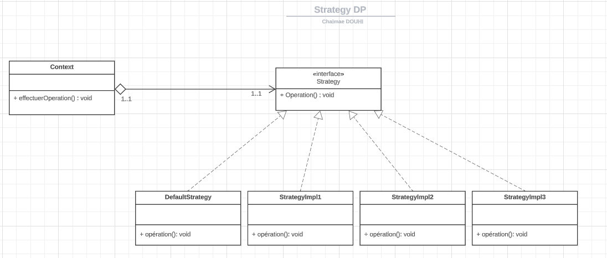
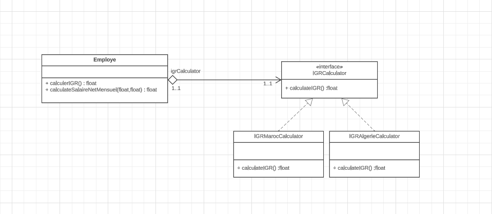

## Strategy Design Pattern
### Description
The Strategy pattern is a behavioral design pattern that enables selecting an algorithm at runtime. It defines a family of algorithms, encapsulates each one, and makes them interchangeable. Strategy lets the algorithm vary independently from clients that use it.

### Class Diagram


### Implementation
#### Strategy Interface
```java
public interface Strategy {
    void operation();
}
```
#### Concrete Strategies
* DefaultStrategyImpl
```java
public class DefaultStrategyImpl implements Strategy{
    @Override
    public void operation() {
        System.out.println("DefaultStrategy");
    }
}
```
* StrategyImpl1
```java
public class StrategyImpl1 implements Strategy{
    @Override
    public void operation() {
        System.out.println("Strategy1");
    }
}
``` 
* StrategyImpl2
```java
public class StrategyImpl2 implements Strategy{
    @Override
    public void operation() {
        System.out.println("Strategy2");
    }
}
```
* Context
```java
public class Context {
    private Strategy strategy = new DefaultStrategyImpl();
    
    public void effectuerOperation() {
        System.out.println("*******");
        strategy.operation();
        System.out.println("*******");
    }

    public void setStrategy(Strategy strategy) {
        this.strategy = strategy;
    }
}
```

## Exercice
On considère la classe Employe (voir annexe) qui est définie par :
* deux variables d’instance cin et salaireBrutMensuel,
* deux constructeurs, les getters et setters
* et une méthode calculerIGR qui retourne l’impôt général sur les revenus salariaux.
* La méthode getSalaireNetMensuel retourne le salaire net mensuel.
Supposant que la formule de calcul de l’IGR diffère d’un pays à l’autre.
Au Maroc, par exemple le calcul s’effectue selon les cas suivant :
* Si le salaire annuel est inférieur à 40000, le taux de l’IGR est : 5%
* Si le salaire annuel est supérieur à 40000 et inférieur à 120000, le taux de l’IGR est : 20%
* Si le salaire annuel est supérieur à 120000 le taux de l’IGR est : 42%
En Algérie, le calcul s’effectue en utilisant un taux unique de 35%.
Comme cette classe est destinée à être utilisée dans différent type de pays inconnus au moment du développement de
cette classe,
1. Identifier les méthodes qui vont subir des changements chez le client.
2. En appliquant le pattern strategie, essayer de rendre cette classe fermée à la modification et ouverte à l’extension.
3. Créer une application de test.
4. Proposer une solution pour choisir dynamiquement l’implémentation de calcul de l’IGR.

### Class Diagram


### Implementation
#### Employe class
```java
public class Employe {
    private String cin;
    private float salaireBrutMensuel;
    private IGRCalculator igrCalculator;

    public Employe(String cin, float salaireBrutMensuel) {
        this.cin = cin;
        this.salaireBrutMensuel = salaireBrutMensuel;
    }

    public float calculerIGR() {
        ValidationUtils.validateSalaireBrutMensuel(salaireBrutMensuel);
        var salaireBrutAnnuel = calculateSalaireBrutAnnuel(salaireBrutMensuel);
        return igrCalculator.calculateIGR(salaireBrutAnnuel);
    }

    public float calculateSalaireNetMensuel(float salaireBrutMensuel, float igr) {
        float salaireNetAnuel = calculateSalaireBrutAnnuel(salaireBrutMensuel) - igr;
        return salaireNetAnuel / 12;
    }

    public void setIgrCalculator(IGRCalculator igrCalculator) {
        this.igrCalculator = igrCalculator;
    }

    public float getSalaireBrutMensuel() {
        return salaireBrutMensuel;
    }
}
```

#### IGRCalculator interface
```java
public interface IGRCalculator {
    float calculateIGR(float salaireBrutAnnuel);
}
```

#### IGRMarocCalculator class
```java
public class IGRMarocCalculator implements IGRCalculator {
    @Override
    public float calculateIGR(float salaireBrutAnuel) {
        if (salaireBrutAnuel < 40000) {
            return salaireBrutAnuel * 0.05f;
        } else if (salaireBrutAnuel < 120000) {
            return salaireBrutAnuel * 0.20f;
        } else {
            return salaireBrutAnuel * 0.42f;
        }
    }
}

```

#### IGRAlgerieCalculator class
```java
public class IGRAlgerieCalculator implements IGRCalculator {

    @Override
    public float calculateIGR(float salaireBrutAnuel) {
        return salaireBrutAnuel * 0.35f;
    }
}
```

#### ValidationUtils class
```java
public class ValidationUtils {
    public static void validateSalaireBrutMensuel(float salaireBrutMensuel) {
        if (salaireBrutMensuel <= 0) {
            throw new IllegalArgumentException("Le salaire brut mensuel doit être positif.");
        }
    }
}
```

##  Conclusion

The Strategy pattern allows you to define a family of algorithms, encapsulate each of them and make them interchangeable. It allows algorithms to be varied independently of the clients who use them.


